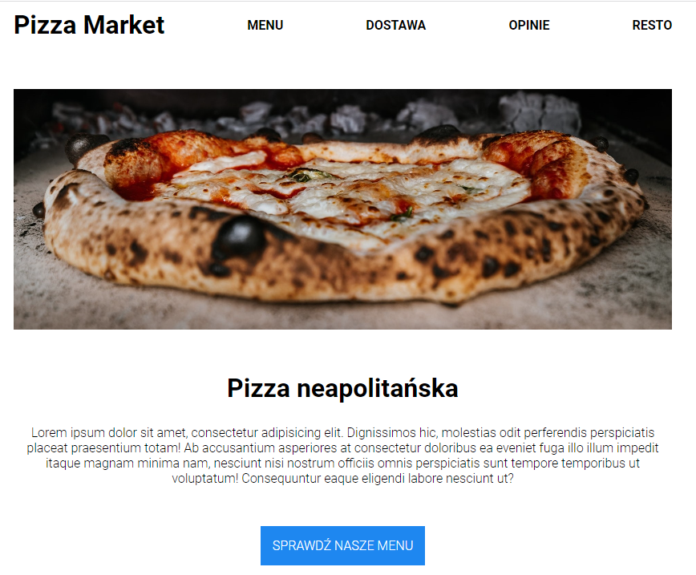
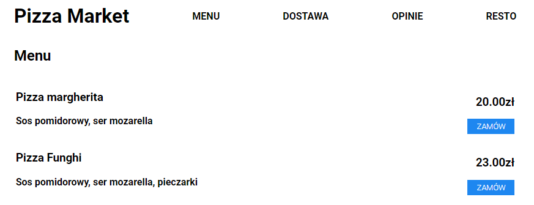
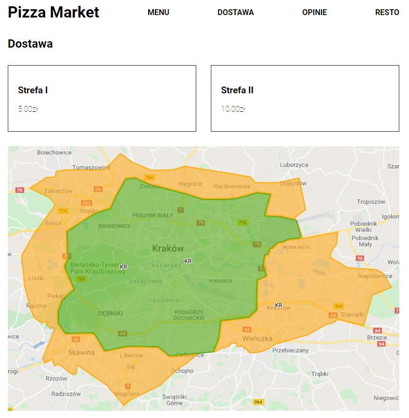
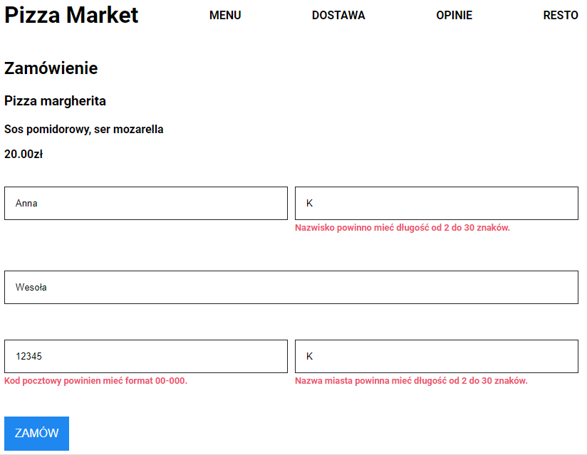
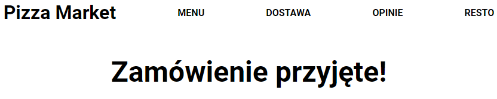
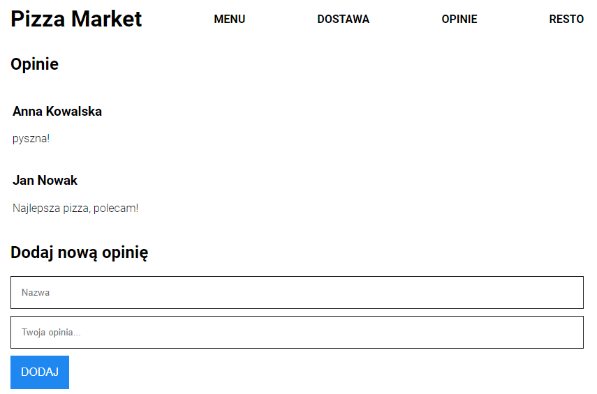
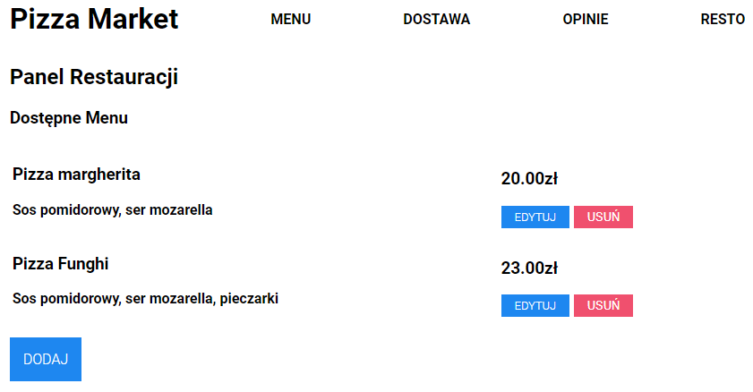
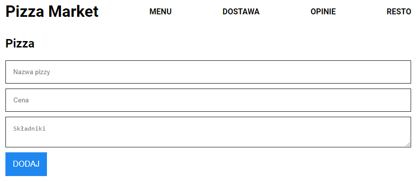

# pizza-market

### Home Page
The application was created to meet business needs of the local pizzeria. Customers can view information about the pizzeria and navigate trough the application. 

### Menu Page
One of the basic functionalities is the ability to browse the available menu of the pizzeria.

### Delivery View
Customers can also check map of the available delivery zones and delivery costs.

### Order Page
Pizza market customers are able to select menu items and complete the order by providing the delivery address. If the form is filled incorretly, validation messages are displayed. 

After the order process is completed correctly a confirmation message appears.
  

### Opinions Page
Having used restaurant services, customers have an option to leave feedbacks. All existing reviews are displayed on the Opinions Page. 

### Administrator Panel
The application also includes a section created for the needs of restaurant owners. As administrators, they can manage the menu, i.e. add, edit and remove pizzas from the menu. 

